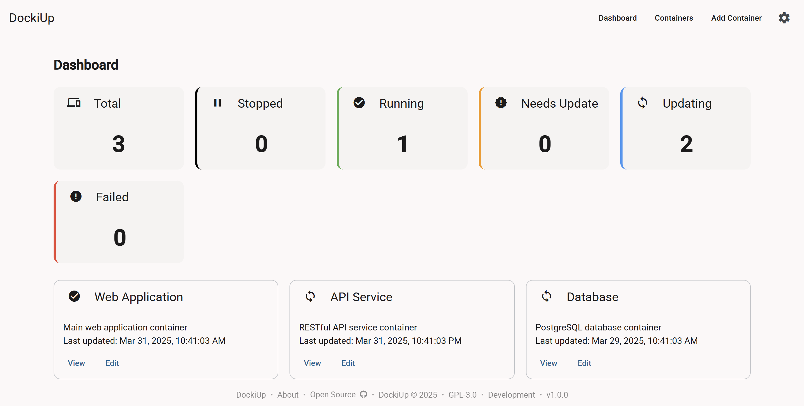

<p align="center"> 
    
</p>
<p align="center">
    <strong>DockiUpV2</strong> - Git-based Docker container deployment automation
</p>
<p align="center">
    You commit, we pull, build, and deploy.
</p>
<p align="center">
    <a href="/docs/docs.md"></a>
    <a href="/docs/installation_guide.md"></a>
    <a href="/docs/dev_setup.md"></a>
</p>

---

## 🚀 What is DockiUp?

DockiUp monitors your Git repositories for changes, then automatically:
1. Pulls the latest changes from your specified branch
2. Rebuilds your Docker containers with the updated code
3. Deploys the new containers with minimal downtime

Perfect for developers who want a simple CI/CD pipeline for their personal projects.

## 🖼️ Screenshots

<p align="center">
    
</p>

## ✨ Features

- **Automatic Monitoring**: Checks for Git repository changes at customizable intervals
- **Manual Trigger**: Force updates on demand via the intuitive web interface
- **Multi-Repository Support**: Manage multiple projects from a single dashboard
- **Flexible Configuration**:
  - Set custom check intervals (from 5 minutes to daily)
  - Specify which Git branch to monitor
  - Configure rebuild parameters
- **Authentication Support**: Works with both public and private Git repositories

## 🔧 How It Works

DockiUp runs as a service that:
1. Monitors your specified Git repositories for new commits
2. When changes are detected, pulls the latest code
3. Rebuilds Docker containers based on the updated code
4. Restarts the containers with your specified configuration

## 📋 Getting Started

1. **Installation**: [Documentation](docs/docs.md) for setup instructions
2. **Configuration**: Add your Git repositories and Docker settings
3. **Scripts**: Use the `scripts/` folder for DB and migration helpers (`Db-Script.ps1`, `Db-Script-GUI.ps1`).
4. **Monitor**: Watch your containers stay up-to-date automatically

## 💻 Technical Details

- DockiUp requires access to the Docker socket to manage containers
- Runs as a Docker container
- Supports webhook integration for instant updates

### Frontend (DockiUp.Frontend)

The web UI lives **inside this repo** at `src/DockiUp.Frontend` (Angular, Material, layout with theme toggle). For local development, run the API and the frontend separately; the API allows CORS from `http://localhost:4200`.

**Run frontend:** From `src/DockiUp.Frontend`: `npm install` then `npm start`. Generate the API client with `npm run apigen` (uses running API at `http://localhost:5098/openapi/v1.json`) or `npm run apigen:live` (same; requires the API running).

**Docker (full image with frontend):** The Dockerfile builds the frontend from `src/DockiUp.Frontend` in this repo. Build with `docker build -f src/DockiUp.API/Dockerfile .`

**API-only Docker:** Use `Dockerfile.backend` when the frontend is served separately: `docker build -f src/DockiUp.API/Dockerfile.backend -t dockiup:api .`

### Run full stack with Docker (DB + API)

To run the database and API in Docker for full-stack testing:

1. **Create `.env`** from the example (required for `docker compose`):
   ```bash
   cp .env.example .env
   ```
   Edit `.env` and set at least `POSTGRES_PASSWORD`; set `POSTGRES_USER` and `POSTGRES_DB` if you prefer (defaults: `postgres`, `dockiupdb`). `PROJECTS_PATH` defaults to `/app/projects`.

2. **Start DB + API (full image with frontend):**
   ```bash
   docker compose up -d
   ```
   - API (and built-in frontend): **http://localhost:8080**
   - PostgreSQL: `localhost:5432` (from `.env`: `POSTGRES_USER`, `POSTGRES_DB`)

3. **Or start DB + API only** (faster build; run frontend locally):
   ```bash
   docker compose -f compose.backend.yml up -d
   ```
   Then run the frontend from `src/DockiUp.Frontend` with `npm start` and point it to `http://localhost:8080`.

4. **Development: DB only** (run API and frontend on the host):
   ```bash
   docker compose -f compose.dev.yml up -d
   ```
   PostgreSQL is on `localhost:5433` (database `dockiupdb-dev`). Point your local API connection string to that port.

Migrations run automatically on API startup. The API container mounts the Docker socket so it can manage compose projects on the host.

## 📜 License

This project is licensed under the GPL-3.0 License.  
See the [LICENSE](LICENSE) file for details.

---
<p align="center">Made with ❤️ by <a href="https://github.com/Pianonic">PianoNic</a></p>
